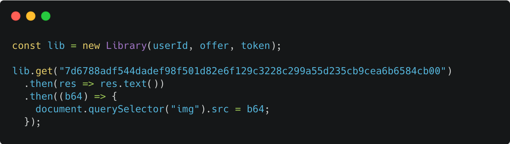
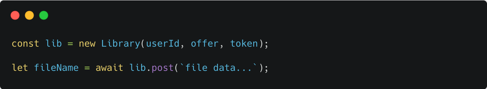
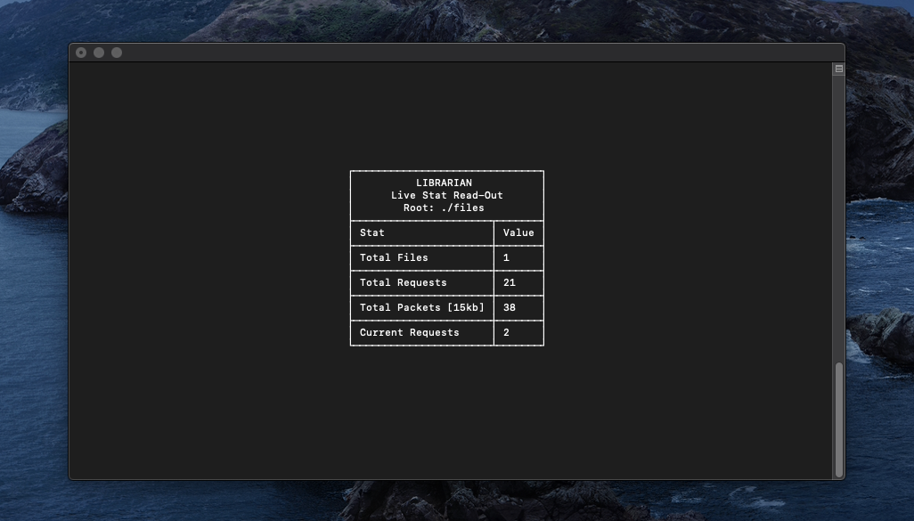

<h1 align="center">
  <br>
  <a href="http://library.llib.sh"></a>
  <br>
</h1>

Library is a set of tools that enables super fast streaming by combining torrenting protocols with WebRTC

## How it works
Library speeds up the downloading process by taking the load one server would normally have, dividing it into 256 packets that are competitively bid on by individuals that will earn based upon how much they contribute to the total file. The process is first started with the requester minting a contract and sending it to a trusted node (dwey). Once the trusted node receives the contract, it publishes it to all the miners that are connected to its WebSocket channel. Then if the miner decides to accept the contract it checks if it has the requested file, collects the requester's webRTC connection information, and forwards its connection information to the requester through the trusted node. When the webRTC connection is finally made the peer sends the packet number it is currently on and the process continues from there where each miner connects and gets sent a packet. After they send the packet the requester sends them the next packet number until they receive all 256 packets it needs. Now that the requester has all the packets it sends on the last request that contains all the payment information. If the receiver fails to send this data it will be charged a fine of 10x the original payment amount to ensure there is no incentive to not pay the miners.

## Install

#### Local Install
```
npm install libpkg
```
#### CLI Install
```
npm install libpkg -g
```
#### Library.js

``` html
<script src="https://unpkg.com/libpkg/dist/library.min.js"></script>
```

## Usage
##### Library.js
Library.js is the client side framework of the network.
#### GET file
  
####  POST file
 

## Api
### `lib = new Library(userId, offer, token)`
#####  Create a client connection to the network
_userId_:  Id that the trusted node assigns to your account

_offer_:  Offer to reward the nodes that server the file

_token_: Secret token you share with the trusted node

### `lib.get(fileName)`
##### Retrive file from network and handle data
_fileName_: SHA256 hash of file (returned by "lib.post")

##### returns:
**[Promise]** [_Responce Object_](https://developer.mozilla.org/en-US/docs/Web/API/Response): Output is calculated as below
```javascript
// file = "7dsa968d6a7s86d7ysa7d9..." (file data returned by nodes)

// Convert "file" to base64

return new Promise(async function(resolve, reject) {
  let b64 = btoa(file);
  // Attempt to find file format if possible
  let mime = detectMimeType(base64);
  // fetch base64 URL of the file data and return the promise
  resolve(fetch(`data:${mime};base64,${base64}`).catch(reject))
})

```
###### Responce Object Methods
_res.text()_: returns a promise the resolves with a plain text responce

_res.json()_: returns a promise the resolves with a parsed JSON responce

_res.blob()_: returns a promise the resolves with a blob of the provided data

_res.arrayBuffer()_: returns a promise the resolves with a ArrayBuffer of the provided data

_res.clone()_: returns a promise the resolves with a clone of the provided data


### `lib.post(fileData)`
##### Publish file to the network
_fileData_: Any string that contains data you want to store on the network

**NOTE**: fileData _must_ be a String, any other type _will_ be rejected

##### returns:
**[Promise]** _fileName_ : A SHA256 hash of the file, used as the fileId to retrive the file

## Librarian
Librarian is the CLI node, below describes the usage of it.
##### Usage
```
librarian --f <files> -t <token> -a <user> -o <offer>
```
###### Display settings
_-q_, --quiet: **[Boolean]** Quiet mode

_-f_, --files: **[String]** Route to store hosted files

_-t_, --token: **[String]** Your unique token given at sign up

_-u_, --user: **[String]** Your user id given at sign up

_-o_, --offer: **[Boolean]** Your minimum accepted offer in cents USD

_-l_, --log: **[Boolean]** Optional, Enable logging

_-q_, --quiet: **[Boolean]** Optional, Quiet mode

_-h_, --host: **[String]** Optional, URL of your preferred trusted node. _Defaults to "http://llib.sh/dwey"_

##### Default layout
  
